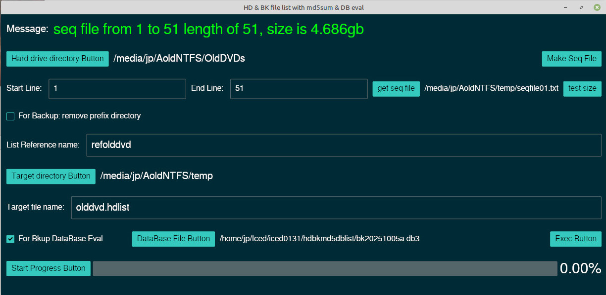

# hdbkmd5sum
Rust-Iced program: reads a hard drive directory and outputs a csv file with vertical bar separator and generates md5sum for each file.
The checkbox is for bluray disks that where dumped to harddrive.
This is processed with a seq. file, so it will process given a start and end line. 
Also has the option to access the backup database to determine no backups, 1 backup or multiple backups.
Very slow process, but good to run in background.

This program calls winitsize01 to get the smallest monitor size.

